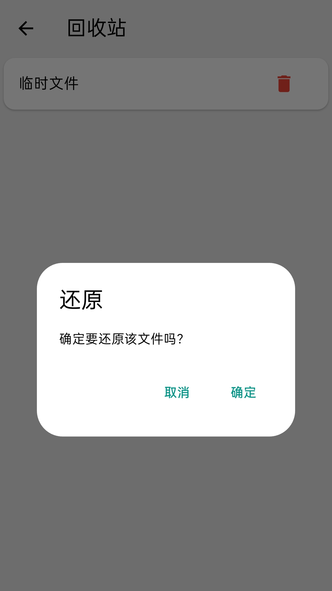

# 自由文档

# 基于 Appflowy Editor 开发

## 简介

一款简单、自由好用的轻量级富文本文档编辑器

### ✨ 功能介绍

📝 文本编辑 - 支持标题、列表、文字样式等富文本编辑功能

📝 文档管理 - 文档新建、保存、另存为、重命名、永久删除和回收站等功能

🎨 主题切换 - 亮色/深色模式；支持跟随系统，明暗随心，护眼更酷

### ✨ 核心亮点

📝 即时编辑器 - 选中内容，点击工具栏文档内容更改立即生效可见，所见即所得

🌐 多平台统一 - 一次开发适配多端，手机、平板和 PC 自动适配横屏/竖屏。保持界面与交互逻辑一致性，大屏小屏都顺手

## 截图

### 手机

### 电脑

## 支持平台

- macOS
- 鸿蒙
- 安卓

## 现在的功能

- 📝 富文本编辑 💾 另存为 🎨 主题切换

## 安装与运行

下载安装

### 开发环境要求

- 电脑，鸿蒙需要鸿蒙 flutter

## 使用说明

打开使用

## 项目结构

自己看

## 开发计划

没有计划全是变化

## 贡献

帮我修 Bug，教我怎么开发

## 开源协议

[LICENSE](LICENSE)
